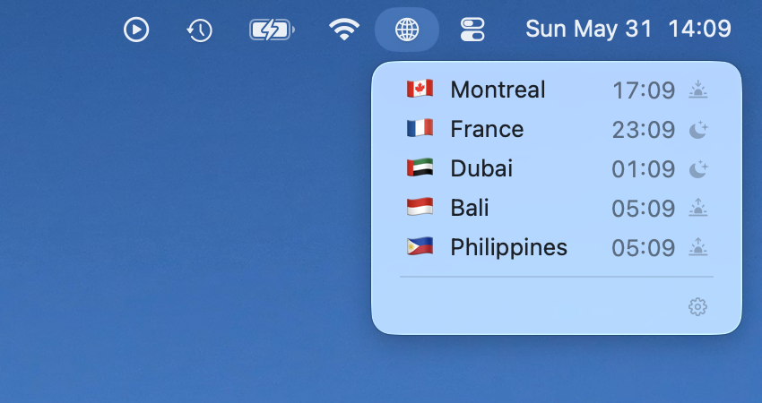
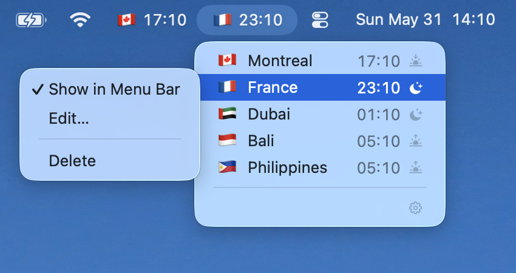
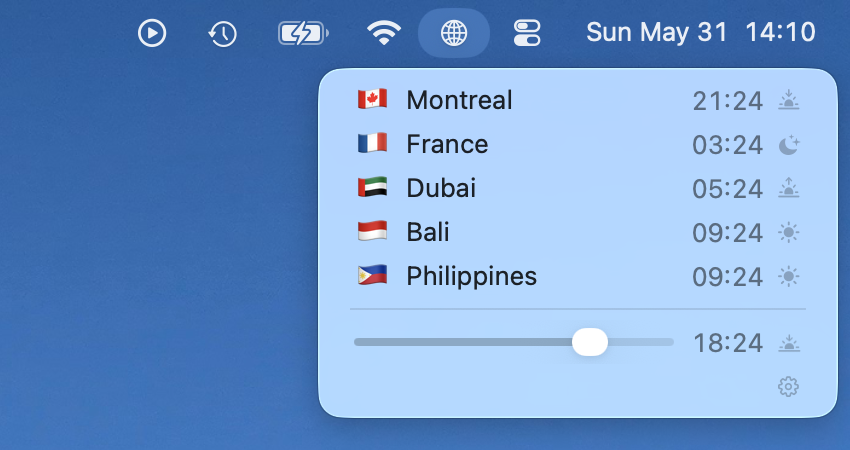

# TZBar

[](#) [](#)

A native macOS menu bar app for world clocks. Add time zones, name them, pin favorites to the bar, and check times at a glance.

**[Download TZBar](https://evetools.app/en/tzbar)**

## Screenshots

<table>
  <tr>
    <td align="center">
      
      <br><sub>All zones in one menu</sub>
    </td>
    <td align="center">
      
      <br><sub>Favorite on the bar</sub>
    </td>
    <td align="center">
      
      <br><sub>Preview another time today</sub>
    </td>
  </tr>
</table>

## Features

- **Menu bar clocks:** Open the globe (or a pinned clock) to see all your zones in one menu
- **Pin to menu bar:** Show emoji and live time for any clock directly in the bar
- **Time scrubber:** Drag to preview times across all zones for another moment today (great for meetings and "are they awake yet?")
- **City search:** Add places by name, the app resolves the time zone for you
- **Custom labels & emoji:** Rename clocks ("Tokyo office", "Mom") and pick flags or emoji
- **Day phase icons:** Optional sun/moon hints for morning, day, evening, and night
- **Launch at login:** Optional, off by default

## Built for efficiency

TZBar is a menu bar utility, not a background service.

- **Icon-only mode:** no timers, no periodic work-idle CPU and memory stay negligible while the menu is closed
- **Pinned mode:** clocks update on each local minute boundary only (`:00`), not on a fast poll loop
- Native **AppKit**, no sync stack, no widgets, no tracking, no dependencies, just clocks when you need them

Requires **macOS 15** or later.

## Use cases

- Coordinating with remote teams across time zones
- Scheduling international calls without mental math
- Tracking home time while traveling
- Staying in touch with family and friends abroad

## Build from source

```bash
make run            # Debug build and run
make build          # Debug build
make build-release  # Release build
```

## License

This project uses the [PolyForm Noncommercial License 1.0.0](LICENSE). You may use and modify the software for noncommercial purposes.

## Alternatives

- **[There](https://there.pm/):** solid, MIT, claims low CPU usage yet [heavy power usage](https://github.com/dena-sohrabi/There/issues/14) on my machine (hence why I built my own)
- **[Zone Bar](https://sindresorhus.com/zone-bar):** also solid, $4, closed source
